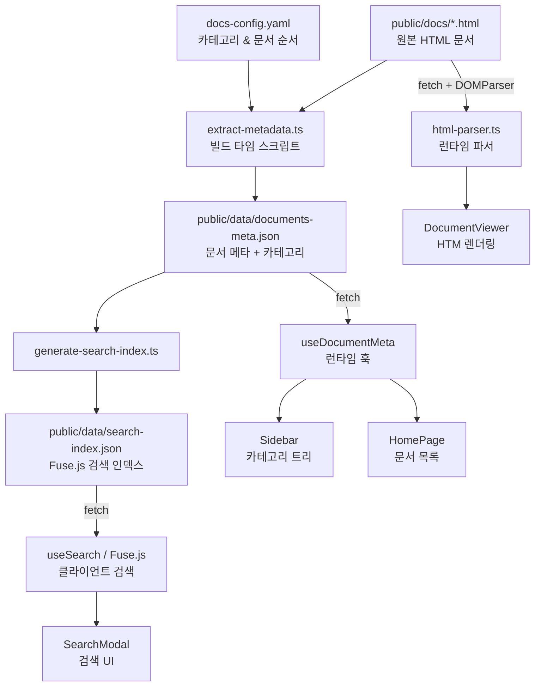

# 아키텍처

## 전체 데이터 흐름



## 렌더링 파이프라인

HTML 문서는 **빌드 타임**에 메타데이터만 추출하고, 실제 렌더링은 **런타임**에 원본 HTML을 그대로 사용합니다.

```
fetch('/docs/{filename}.html')
  ↓
DOMParser 파싱
  ↓
추출:
  ├── <style> 내용 → CSS 스코핑 후 <head>에 주입
  ├── button[data-t] / button[data-tab] → 탭 메타데이터
  └── #p-{tabId} / #panel-{tabId} → 탭별 innerHTML
제거:
  ├── <aside class="sidebar"> (앱 사이드바로 대체)
  ├── <div class="top-tabs"> (React TabBar로 대체)
  └── <script> 태그 (React가 탭 전환 처리)
  ↓
React 렌더링:
  ├── TabBar — 탭 버튼
  ├── TabPanel — dangerouslySetInnerHTML로 콘텐츠 주입
  └── <style data-doc-id> — 스코핑된 원본 CSS
```

## CSS 스코핑 전략

원본 HTML의 `<style>`을 추출하여 `.doc-content` 하위로 스코핑합니다.

**보존하는 CSS** (원본 시각 요소):

| 클래스 | 용도 |
|--------|------|
| `.cg`, `.card` | 2컬럼 카드 그리드 |
| `.code-block`, `.cm/.kw/.str/.fn/.num` | 코드 블록 + 인라인 구문 강조 |
| `.note`, `.note-warn` | 콜아웃 박스 |
| `.gauge-row`, `.gauge-fill` | 프로그레스 바 |
| `.flow`, `.flow-node` | 플로우 다이어그램 |
| `.analogy`, `.level-table` | 매핑 카드, 테이블 |
| `:root { --c-speed, --c-stable, ... }` | 문서별 CSS 변수 |

**제거하는 CSS** (앱 셸이 대체):

| 대상 | 이유 |
|------|------|
| `.sidebar`, `.main`, `.layout` | 앱 레이아웃으로 대체 |
| `.top-tabs`, `.tab-panel` | React TabBar/TabPanel로 대체 |
| `body`, `*`, `html` 전역 리셋 | 앱 globals.css와 충돌 |
| `margin-left: var(--sidebar-w)` | 앱이 반응형 처리 |

**다크 모드 CSS 변수 오버라이드** (`src/styles/document.css`):

28개 HTML 문서는 3가지 CSS 변수 명명 패턴을 사용합니다.
`[data-theme="dark"] .doc-content`에서 세 패턴을 모두 커버합니다:

- Pattern A (dora 계열): `--surface`, `--text`, `--c-speed`, `--c-speed-bg`
- Pattern B (k8s 계열): `--sf`, `--tx`, `--td`, `--bbg`, `--bbd`
- Pattern C (mixed): `--surface`/`--s2`, `--blue-bg`, `--blue-bd`

## 컴포넌트 계층

```
App
└── AppProvider (Context: theme, sidebar, search, recentDocs)
    └── RouterProvider (HashRouter)
        └── Layout
            ├── Sidebar (데스크톱 고정)
            │   └── SidebarItem × N
            ├── MobileNav (모바일 슬라이드)
            ├── TopBar (검색 트리거, 다크 모드 토글, 북마크/메모 링크)
            ├── SearchModal (전역, Cmd+K)
            └── <Outlet>
                ├── HomePage
                ├── DocumentPage
                │   ├── BookmarkButton
                │   └── DocumentViewer
                │       ├── TabBar
                │       ├── TabPanel × N (dangerouslySetInnerHTML)
                │       └── MemoEditor
                ├── BookmarksPage
                └── MemosPage
```

## 상태 관리

| 상태 | 저장소 | 범위 |
|------|--------|------|
| 다크 모드 | localStorage (`sre-hub:theme`) | 전역 |
| 사이드바 열림/닫힘 | React state (AppContext) | 세션 |
| 카테고리 접기 상태 | localStorage (`sre-hub:sidebar-collapsed`) | 영속 |
| 최근 본 문서 | localStorage (`sre-hub:recent-docs`) | 영속 |
| 현재 문서 ID | React state (AppContext) | 세션 |
| 북마크 | IndexedDB (Dexie.js) | 영속 |
| 메모 | IndexedDB (Dexie.js) | 영속 |
| 탭 상태 | URL query (`?tab=`) | URL |

## 검색 파이프라인

```
빌드 타임:
  documents-meta.json (섹션별 title + content)
    → generate-search-index.ts
    → search-index.json (flat SearchResult[])

런타임:
  search-index.json fetch (모듈 레벨 싱글턴 캐시)
    → Fuse<SearchResult> 초기화 (Promise 싱글턴, race condition 방지)
    → 입력 debounce 300ms
    → fuse.search(query) → 카테고리별 그룹핑 → UI 렌더링
```

Fuse.js 설정: `keys: [title, sectionTitle, content]`, `threshold: 0.35`

## 다크 모드 구현

**FOUC 방지**: `index.html` `<head>`의 인라인 스크립트가 React 초기화 전에 `data-theme`를 `<html>`에 적용합니다.

```html
<script>
  var s = localStorage.getItem('sre-hub:theme');
  var dark = s === 'dark' || (!s && window.matchMedia('(prefers-color-scheme: dark)').matches);
  document.documentElement.setAttribute('data-theme', dark ? 'dark' : 'light');
</script>
```

**적용 레이어**:
1. `globals.css` — 앱 셸 CSS 변수 (`--color-bg`, `--color-surface` 등)
2. `document.css` — `.doc-content` 내 원본 HTML CSS 변수 오버라이드
3. `AppContext.tsx` — React 상태 동기화 + OS 변경 감지
